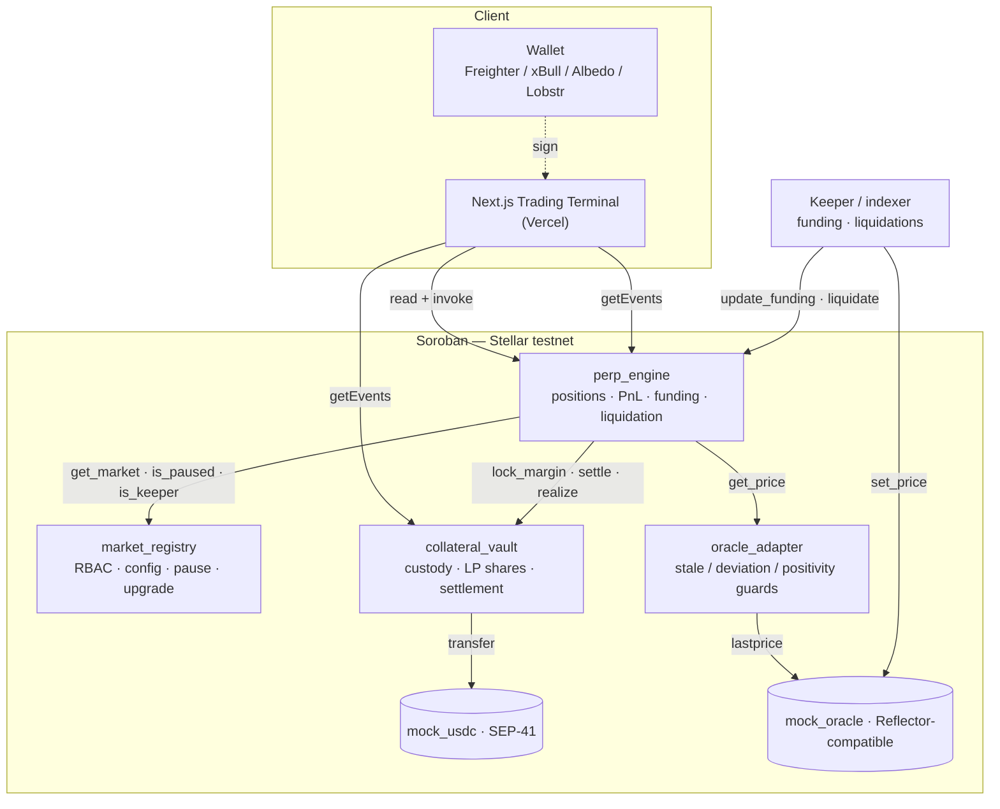
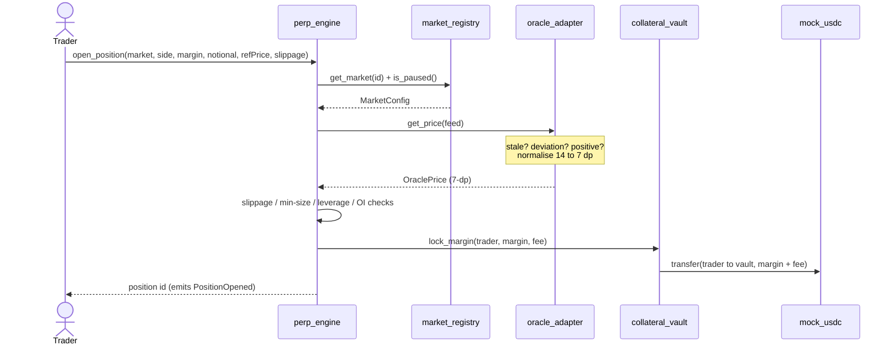
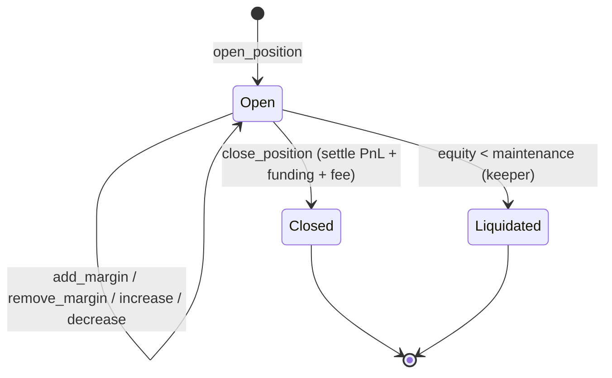

<div align="center">

# Helix

**Decentralized perpetual futures on gold, FX and crypto — margined and settled on-chain in USDC, on Stellar / Soroban.**

<p>
  <a href="https://helix-perp.vercel.app"><b>Live Demo</b></a>
  &nbsp;&middot;&nbsp;
  <a href="#deployment-stellar-testnet"><b>Contracts</b></a>
  &nbsp;&middot;&nbsp;
  <a href="#architecture"><b>Architecture</b></a>
  &nbsp;&middot;&nbsp;
  <a href="#60-second-demo"><b>Demo Script</b></a>
</p>

<p>
  
  
  
  
</p>

<p>
  
  
  
  
  
</p>

</div>

---

## Overview

Perpetual futures are the highest-volume product in DeFi, yet they almost exclusively trade crypto. Stellar's entire thesis — FX, anchors, native stablecoins and **tokenized real-world assets** — is the ideal substrate for a perp DEX that trades the *real* world.

**Helix** is a decentralized perpetual-futures exchange built end-to-end on Soroban. Traders open leveraged long/short positions on price feeds; liquidity providers deposit USDC into a shared vault and earn fees plus funding; a keeper updates funding and liquidates underwater positions. Margin, PnL, funding and liquidation are all enforced on-chain.

> **Why this could only be built on Stellar:** the flagship markets are **XAU-PERP (gold)**, **EUR-PERP (euro)** and **XLM-PERP**, all settled in on-chain USDC. The engine is fully asset-agnostic — markets are config rows in `market_registry`, so listing crypto majors is a one-line change.

| Market | Feed | Max leverage | Category |
| :-- | :-- | :-- | :-- |
| XAU-PERP &nbsp;(Gold) | `XAU` | 20x | Metal / RWA |
| EUR-PERP &nbsp;(Euro) | `EUR` | 25x | FX |
| XLM-PERP &nbsp;(Lumens) | `XLM` | 10x | Crypto |

---

## Highlights

- **Four-contract protocol** with **three live cross-contract calls on every trade** (registry &rarr; oracle &rarr; vault).
- **Custody isolated from logic** — funds in the vault, trading in the engine, control in the registry; each upgradeable independently.
- **Hardened oracle** — a swappable Reflector adapter that rejects stale prices, bounds tick-to-tick deviation and refuses non-positive prices, surfaced as typed contract errors.
- **Real Reflector prices** — the keeper relays live prices from Reflector's decentralised SEP-40 testnet oracle (XLM, EUR) into the protocol each cycle, clamp-converged to stay inside the deviation guard.
- **On-chain limit / stop-loss / take-profit orders** — resting orders live in the engine with margin escrowed at placement, so the keeper fills them when the price trigger is crossed without a trader signature. Cancels refund in full.
- **On-chain leaderboard** — traders ranked by realized PnL and protocol stats, aggregated live from engine events straight off Soroban RPC. No backend, no database.
- **Live keeper** — a scheduled GitHub Action runs one keeper cycle every ~10 min (relay prices, advance funding, liquidate) so the deployed demo stays alive with no always-on server.
- **Shared LP vault** — one USDC pool is the counterparty to every position, with ERC-4626-style shares.
- **Real-time terminal** — positions, funding and liquidations stream from Soroban events into a premium UI with a full sign &rarr; submit &rarr; confirm transaction lifecycle.
- **Verified** — 33 Rust contract tests and 11 web tests passing, six contracts deployed and seeded on testnet, and a live Vercel deployment.

---

## Architecture



### Trade flow — `open_position`



### Position lifecycle



---

## Contracts

| Contract | Responsibility | Notable |
| :-- | :-- | :-- |
| `market_registry` | Controller + RBAC | OpenZeppelin `stellar-access` roles (Admin / Keeper / Pauser), global pause, per-market config, admin-gated `upgrade(wasm_hash)` |
| `collateral_vault` | Custody + LP accounting | Holds USDC for trader margin and LP liquidity; ERC-4626-style shares; engine-gated; LP pool is the counterparty to all PnL, funding and fees |
| `perp_engine` | Position manager (hub) | open / close / increase / decrease / add + remove margin / liquidate; notional PnL, skew-driven funding, liquidation price; three cross-contract calls per trade |
| `oracle_adapter` | Price abstraction + safety | Wraps Reflector behind a stable interface with stale / deviation / positivity guards; swappable to Pyth or DIA |
| `mock_usdc` | Settlement asset | OpenZeppelin `stellar-tokens` SEP-41 token (7 dp) + permissionless demo faucet |
| `mock_oracle` | Demo price feed | Reflector-compatible; deterministic prices for a reproducible demo |

**Accounting.** Everything is `i128` scaled to 7 decimals (matching USDC); the cumulative funding index is 18 dp. Positions are tracked in USD notional (`PnL = notional * (mark - entry) / entry`), keeping the engine asset-agnostic. Funding is open-interest-skew driven and capped per period. A position is liquidated when `equity < maintenance_margin`; the vault never pays out more than it holds.

**Storage and TTL.** Instance storage for singletons, persistent storage for per-key state (markets, positions, LP shares, OI, funding, last price), each with explicit `extend_ttl` on write so active state never expires.

---

## Security

| Control | Where | What it prevents |
| :-- | :-- | :-- |
| Stale / deviation / positivity guards | `oracle_adapter` | Oracle manipulation and single-tick spoofing (typed errors) |
| Role-based access control | `market_registry` | Unauthorized funding, liquidation, pause or config changes |
| Custody isolation | `collateral_vault` | Only `perp_engine` can move collateral; engine wired once and locked |
| Global + per-market pause | `market_registry` | Halts all state transitions in an incident |
| Overflow-checked math | workspace | Traps instead of wrapping — fail-safe for fund custody |
| Slippage / min-size / leverage / OI caps | `perp_engine` | Bad fills and over-exposure, enforced on-chain |

---

## Deployment (Stellar testnet)

Six contracts deployed, wired, and seeded with **500,000 USDC** of LP liquidity plus demo positions. Admin / keeper: [`GBDKBXO7...NMKO`](https://stellar.expert/explorer/testnet/account/GBDKBXO7IGPNYDMVSTJAGPTXQPK32K45YQOFJ54QF6JAAOZDYGXXNMKO).

| Contract | Address | Explorer |
| :-- | :-- | :-- |
| perp_engine | `CCNRZNFFDPY7Y2YNVTLT6RLCHIRHAX5D3B5TX7F2J3PBPO6FEKNBF3RU` | [view](https://stellar.expert/explorer/testnet/contract/CCNRZNFFDPY7Y2YNVTLT6RLCHIRHAX5D3B5TX7F2J3PBPO6FEKNBF3RU) |
| market_registry | `CBKYVMWPQB7R3NXBJ45HVRZMIXFJ2NMRALCHLQHSVQY3MGN7D57SQZXL` | [view](https://stellar.expert/explorer/testnet/contract/CBKYVMWPQB7R3NXBJ45HVRZMIXFJ2NMRALCHLQHSVQY3MGN7D57SQZXL) |
| collateral_vault | `CBKEHG7LINNB73UIEKZNL7ALV7KYT63JU6WLD2BVUUW5GNO7764GVI2W` | [view](https://stellar.expert/explorer/testnet/contract/CBKEHG7LINNB73UIEKZNL7ALV7KYT63JU6WLD2BVUUW5GNO7764GVI2W) |
| oracle_adapter | `CCMYNSD7ZYZVVFRRNNKSSMKQQTUDXBO3TCL6GBGMF4GKIFYBCK6IMQAW` | [view](https://stellar.expert/explorer/testnet/contract/CCMYNSD7ZYZVVFRRNNKSSMKQQTUDXBO3TCL6GBGMF4GKIFYBCK6IMQAW) |
| mock_usdc | `CCZ23IOAR23RXTJPLGR3A6SD4TLBIYFU4E42YRKC2RPVX2QRPUROIKBA` | [view](https://stellar.expert/explorer/testnet/contract/CCZ23IOAR23RXTJPLGR3A6SD4TLBIYFU4E42YRKC2RPVX2QRPUROIKBA) |
| mock_oracle | `CCIQ2IQLXN576DBZDLP6GKBBWQVYAZN2JHBGM4QQHFSVGBBKRK7W6WYZ` | n/a |

Example settlement transaction: [`53135c0a...a61bf0`](https://stellar.expert/explorer/testnet/tx/53135c0ac35a9de6cb8371e24c1bbfeb237259970d4ef1f7d8b56689f0a61bf0).

> On mainnet, collateral is a config address, so the vault points at the real USDC SAC with no code change. The oracle is swappable to the live Reflector contract via `oracle_adapter.set_reflector`.

---

## Tech stack

**Contracts** — Rust, `soroban-sdk 26`, OpenZeppelin `stellar-access` / `stellar-tokens` / `stellar-contract-utils`, built to `wasm32v1-none` with the Stellar CLI.

**Web** — Next.js 15 (App Router), TypeScript (strict), Tailwind design system, React Query, Zustand, Framer Motion, TradingView lightweight-charts, `@stellar/stellar-sdk`, `stellar-wallets-kit`.

**Keeper** — standalone TypeScript worker: funding updates, liquidation scan, event indexer, optional price simulation; runs as a loop or a single `once` cycle (cron / CI).

The terminal ships eight crafted pages — Landing, Trade, Portfolio, Vault, Activity, Transactions, Settings, Analytics — with tabular-mono numerics, one-click test funds, and crafted empty / loading / error states.

---

## Project structure

```
contracts/   Six Soroban contracts + shared crate (Rust)
web/         Next.js trading terminal (lib -> hooks -> components -> app)
keeper/      Off-chain keeper / indexer (TypeScript)
scripts/     deploy_testnet · upgrade_contract · refresh_oracle
.github/     CI (contracts + web + keeper) and Vercel deploy
deploy/      testnet.json (live addresses)
```

---

## Local development

**Prerequisites:** Rust stable + `rustup target add wasm32v1-none`, [Stellar CLI](https://github.com/stellar/stellar-cli) v25.2+, Node 20+ and pnpm.

```bash
# Contracts
stellar contract build            # optimized WASM
cargo test --workspace            # 33 tests
cargo fmt --all --check && cargo clippy --workspace --all-targets

# Web
cd web && pnpm install
pnpm dev                          # http://localhost:3000
pnpm typecheck && pnpm lint && pnpm test && pnpm build

# Keeper
cd keeper && pnpm install
cp .env.example .env              # set KEEPER_SECRET via: stellar keys show helix
pnpm once                         # one cycle (cron/CI)   ·   pnpm start (loop)
```

The web app needs no environment variables — it falls back to the committed deployment in `web/src/config/deployment.json`.

---

## Deploy

```bash
# Contracts -> testnet (deploy, wire, list markets, seed)
stellar keys generate helix --network testnet --fund
pwsh scripts/deploy_testnet.ps1

# Refresh demo oracle prices (the keeper does this continuously in prod)
pwsh scripts/refresh_oracle.ps1

# Demonstrate the admin-gated upgrade path
pwsh scripts/upgrade_contract.ps1 -Package market_registry

# Web -> Vercel
cd web && vercel deploy --prod
```

CI ([.github/workflows/ci.yml](.github/workflows/ci.yml)) runs format, clippy, tests and WASM build for contracts plus typecheck / lint / test / build for the web and keeper on every pull request.

---

## 60-second demo

1. Open the [live app](https://helix-perp.vercel.app) — a terminal-grade landing page with live oracle prices for XAU, EUR and XLM.
2. **Launch terminal**, **Connect wallet** (Freighter), then **Get test funds** — one click funds your account via friendbot and mints 10,000 USDC.
3. On **Trade**, pick XAU-PERP, drag leverage to 10x, enter margin, and watch the liquidation price and fee update live. Open a long and approve in your wallet.
4. The toast tracks sign &rarr; submit &rarr; confirm; the position appears instantly with live PnL and margin ratio.
5. **Portfolio** aggregates equity and PnL. **Vault** shows TVL, utilization and share price — deposit USDC to become the house. **Activity** streams the on-chain events you just created. **Transactions** shows the full lifecycle with explorer links.
6. Every action is verifiable on Stellar Expert.

---

## License

Released under the [MIT License](LICENSE).
